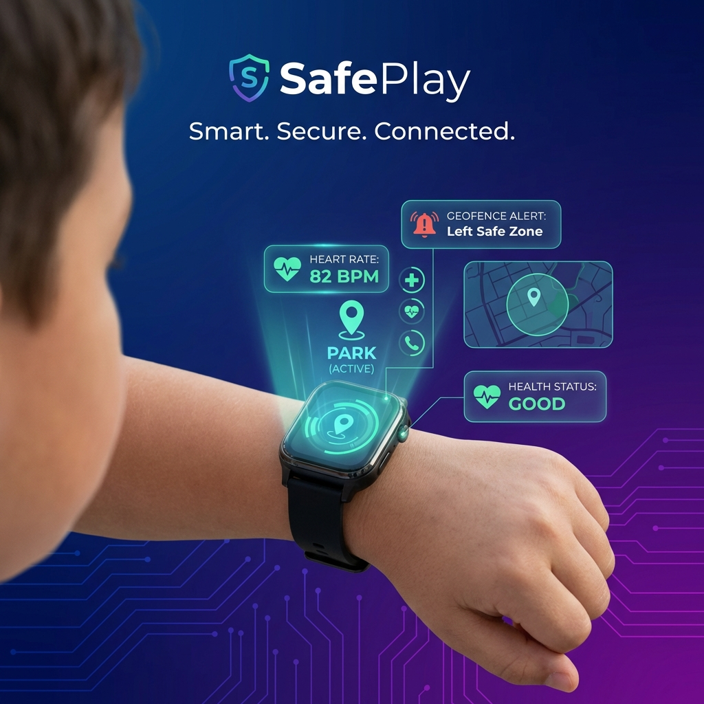
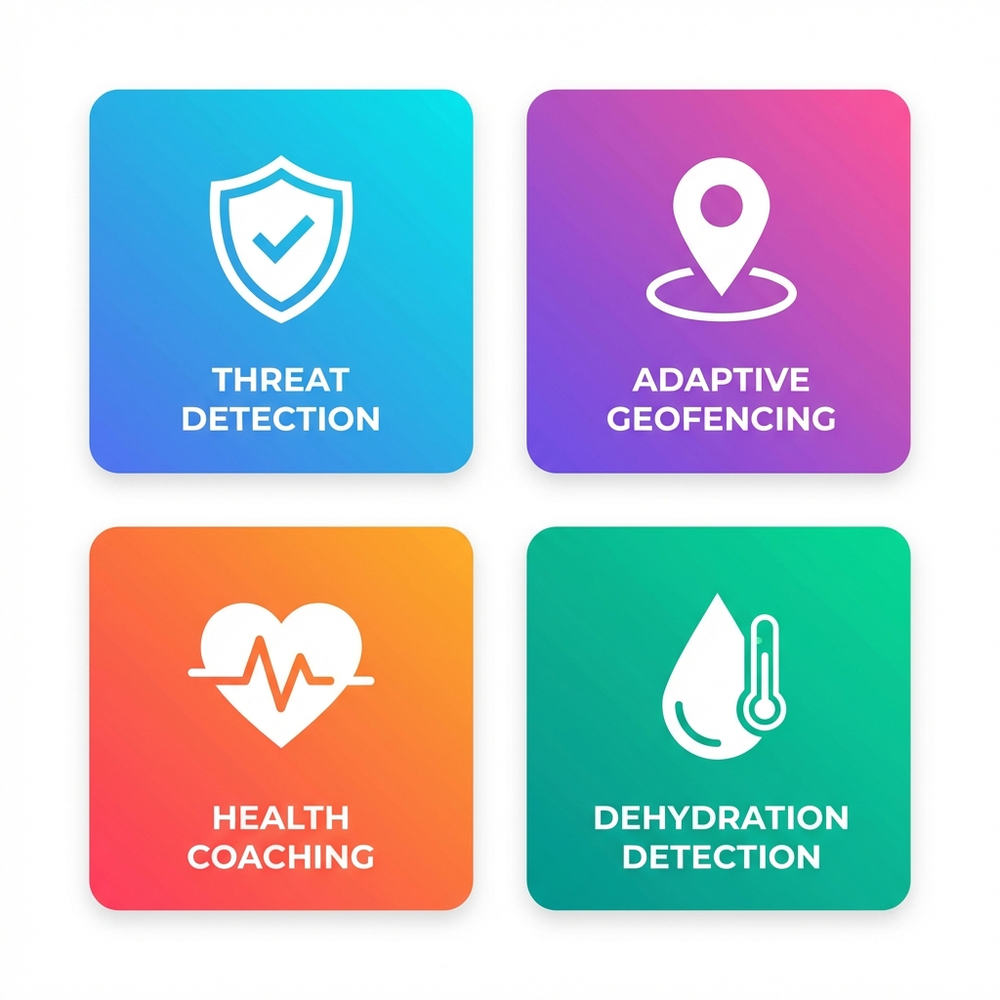
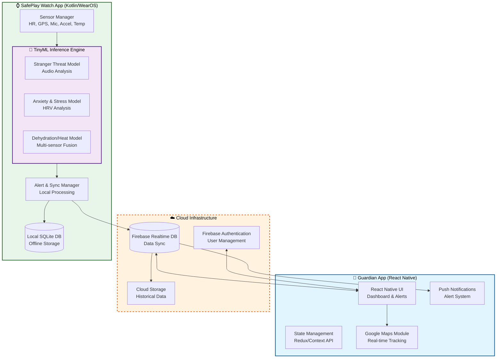

<div align="center">



# 🛡️ SafePlay: Smartwatch-Based Child Safety & Health Monitoring System

**Smart. Secure. Connected.**

[](https://github.com)
[](https://reactnative.dev)
[](https://wearos.google.com)
[](https://www.tensorflow.org/lite)
[](LICENSE)

[Features](#-key-features) • [Architecture](#-system-architecture) • [Getting Started](#-getting-started) • [Tech Stack](#-technology-stack) • [Team](#-development-team)

</div>

---

## 📌 Project Overview

**SafePlay** is a cutting-edge IoT-based wearable solution designed to revolutionize child safety and proactive health monitoring. By addressing critical limitations of existing tracking devices—such as internet dependency, high latency, privacy concerns, and generic health settings—SafePlay leverages **Edge AI (TinyML)** to process sensitive data directly on the smartwatch, ensuring real-time responses and superior privacy protection.

### 🎯 The SafePlay Ecosystem

SafePlay consists of two seamlessly integrated applications:

1. **🌟 SafePlay Watch App (Wear OS)**  
   A standalone smartwatch application built with **Kotlin** that performs real-time threat detection, health analysis, and emergency response—all processed locally on the device using TinyML models.

2. **📱 SafePlay Guardian App (React Native)**  
   A cross-platform mobile application for parents and guardians to receive real-time alerts, monitor their child's location, view health insights, and configure safety parameters.

---

## 🔬 Research Innovation & Novelty

SafePlay introduces groundbreaking features that set it apart from conventional child tracking solutions:

### 🧠 **Privacy-First Edge Intelligence**
- Utilizes **TensorFlow Lite for Microcontrollers (TinyML)** to detect stranger threats and distress signals locally on the smartwatch
- **Raw audio never leaves the device**—only risk alerts are transmitted to parents
- Dual-model architecture fuses danger sound detection with trusted voice verification
- Implements Voice Activity Detection (VAD) and log-Mel feature extraction directly on Wear OS

### 📍 **Adaptive Geofencing**
- Unlike static boundaries, SafePlay dynamically adjusts "safe zones" based on:
  - Time of day (school hours vs. play time)
  - Location context (crowded areas vs. familiar neighborhoods)
  - Activity patterns (stationary vs. moving)
- Automatically tightens boundaries in high-risk areas and expands in safe environments
- Real-time GPS tracking with intelligent zone alerts

### 💓 **Holistic Health Coaching**
- Continuously monitors physiological markers: Heart Rate (HR), Heart Rate Variability (HRV), and motion patterns
- Detects anxiety and stress through a computed stress index
- Provides **just-in-time, on-screen coaching prompts** (e.g., breathing exercises, calming techniques)
- Integrates contextual signals (parent proximity, time of day) to reduce false positives

### 🥤 **Proactive Dehydration & Anomaly Detection**
- Fuses multi-sensor data: accelerometer, skin temperature, SpO₂, and bioimpedance
- Predicts dehydration and heat stress **before** they become critical
- Provides early warnings for heat stress and dizziness-related falls
- Uses context-aware thresholds and baseline learning to minimize false alarms
- Triggers child check-ins when risk levels escalate

---

## ✨ Key Features

<div align="center">



</div>

### 1. 🛡️ Stranger Threat Detection (Edge AI)

**Function:** Uses the watch microphone to analyze environmental audio patterns and identify potential risks in real-time.

**Innovation:**
- Dual-model design fuses danger sound recognition with trusted voice verification
- All processing happens on the smartwatch—**no audio data is transmitted to the cloud**
- Integrates Voice Activity Detection (VAD) and log-Mel spectrogram feature extraction
- Instant alerts sent to parents when threats are detected

**Privacy:** Raw audio never leaves the device; only risk alerts are transmitted.

---

### 2. 📍 Adaptive Geofencing

**Function:** Intelligent location tracking that dynamically adjusts "safe zones" based on context and activity.

**Innovation:**
- Boundaries automatically tighten in high-risk areas (e.g., crowded public spaces)
- Boundaries expand in safe environments (e.g., school, home, familiar parks)
- Time-based zone adjustments (e.g., stricter during evening hours)
- Real-time GPS tracking with low battery consumption

**Technology:** Utilizes Android Location Services API with custom zone management algorithms.

---

### 3. 💓 Anxiety-Aware Safety & Health Coaching

**Function:** Continuously monitors physiological markers to detect stress and anxiety in real-time.

**Innovation:**
- Analyzes Heart Rate (HR), Heart Rate Variability (HRV), and motion patterns
- Computes a real-time stress index using multi-sensor fusion
- Provides **on-screen coaching prompts** for breathing exercises and calming techniques
- Context-aware filtering reduces false positives (e.g., considers parent proximity, time of day)

**Impact:** Supports emotional well-being and helps children manage stress proactively.

---

### 4. 🥤 Pediatric Dehydration & Anomaly Detection

**Function:** Fuses accelerometer data with vital signs to detect heat stress and dehydration before they become critical.

**Innovation:**
- Multi-sensor fusion: skin temperature, SpO₂, bioimpedance, and motion data
- Provides **proactive early warnings** for heat stress and dizziness-related falls
- Uses adaptive thresholds and baseline learning to reduce false alarms
- Triggers child check-ins and hydration reminders when risk levels escalate

**Mechanism:** Lightweight on-device TinyML model classifies risk levels in real-time.

---

## 🏗 System Architecture

SafePlay's architecture prioritizes **local processing** on the smartwatch to minimize latency, reduce battery consumption, and protect privacy. The cloud is used primarily for data synchronization, long-term storage, and parent-child communication.



### 🔄 Data Flow Overview

1. **Sensor Data Collection:** The smartwatch continuously collects data from multiple sensors (heart rate, GPS, microphone, accelerometer, temperature).
2. **Edge AI Processing:** TinyML models process sensor data locally to detect threats, stress, and health anomalies.
3. **Local Alert Generation:** Critical alerts are generated on the watch and stored in local SQLite database.
4. **Cloud Synchronization:** Alerts and health data are synced to Firebase Realtime Database when connectivity is available.
5. **Parent Notification:** The Guardian App receives real-time push notifications and displays alerts on the dashboard.
6. **Historical Analysis:** Long-term data is stored in Cloud Storage for trend analysis and reporting.

---

## 🛠 Technology Stack

### 📱 Guardian Mobile Application (Parent)

| Component | Technology |
|-----------|-----------|
| **Framework** | React Native 0.81.5 |
| **Language** | TypeScript 5.9.2 |
| **State Management** | Redux / Context API |
| **Navigation** | React Navigation (Stack & Bottom Tabs) |
| **Maps** | React Native Maps (Google Maps API) |
| **Charts** | React Native Chart Kit |
| **Backend** | Firebase Realtime Database & Authentication |
| **Storage** | AsyncStorage |
| **Icons** | Expo Vector Icons |

### ⌚ SafePlay Watch Application (Child)

| Component | Technology |
|-----------|-----------|
| **Platform** | Wear OS (API 30+) |
| **Language** | Kotlin |
| **AI/ML Framework** | TensorFlow Lite for Microcontrollers (TinyML) |
| **Sensors** | Android Sensor API (Accelerometer, Gyroscope, Heart Rate, Microphone, GPS) |
| **Audio Processing** | Voice Activity Detection (VAD), log-Mel Feature Extraction |
| **Local Database** | SQLite / Room |
| **Backend Integration** | Firebase Realtime Database & Cloud Messaging |
| **Build Tool** | Gradle |

### ☁️ Backend & Infrastructure

| Component | Technology |
|-----------|-----------|
| **Database** | Firebase Realtime Database |
| **Authentication** | Firebase Authentication |
| **Storage** | Firebase Cloud Storage |
| **Push Notifications** | Firebase Cloud Messaging (FCM) |
| **Hosting** | Firebase Hosting (for admin dashboard) |

---

## 🚀 Getting Started

Follow these instructions to set up the SafePlay project locally for development and testing.

### 📋 Prerequisites

Before you begin, ensure you have the following installed:

- **Node.js** (v18 or newer) - [Download](https://nodejs.org/)
- **npm** or **yarn** - Comes with Node.js
- **Android Studio** (Koala or newer) - [Download](https://developer.android.com/studio)
- **Java Development Kit (JDK) 17** - [Download](https://www.oracle.com/java/technologies/downloads/)
- **React Native CLI** - Install via `npm install -g react-native-cli`
- **Expo CLI** (for mobile app) - Install via `npm install -g expo-cli`
- **Git** - [Download](https://git-scm.com/)

### 📱 Setting up the Guardian Mobile App (React Native)

1. **Clone the repository:**
   ```bash
   git clone https://github.com/your-repo/safeplay.git
   cd safeplay/ChildSafetyApp
   ```

2. **Install dependencies:**
   ```bash
   npm install
   ```

3. **Configure Firebase:**
   - Create a Firebase project at [Firebase Console](https://console.firebase.google.com/)
   - Download `google-services.json` and place it in `android/app/`
   - Download `GoogleService-Info.plist` and place it in `ios/` (for iOS)

4. **Run on Android:**
   - Ensure you have an Android Emulator running or a physical device connected with USB Debugging enabled
   ```bash
   npm run android
   # or
   expo run:android
   ```

5. **Run on iOS (Mac only):**
   ```bash
   cd ios
   pod install
   cd ..
   npm run ios
   # or
   expo run:ios
   ```

6. **Start the development server:**
   ```bash
   npm start
   ```

### ⌚ Setting up the SafePlay Watch App (Kotlin/Wear OS)

1. **Navigate to the smartwatch app directory:**
   ```bash
   cd safeplay/smartwatch-app
   ```

2. **Open Android Studio:**
   - Select **"Open an existing project"**
   - Navigate to the `smartwatch-app` folder and open it

3. **Sync Gradle:**
   - Let Gradle sync completely (this may take a few minutes)

4. **Configure Firebase:**
   - Download `google-services.json` from your Firebase console
   - Place it in `smartwatch-app/app/` directory

5. **Create a Wear OS Virtual Device:**
   - Open **AVD Manager** in Android Studio
   - Create a new virtual device (e.g., Wear OS Small Round API 30)
   - Or connect a physical Wear OS watch via ADB

6. **Build and Run:**
   - Click the green **Run** button (or press `Shift+F10`)
   - Select your Wear OS device/emulator
   - The app will be deployed to the watch

### 🔑 Firebase Configuration

> **Important:** Ensure you have the `google-services.json` file from your Firebase console placed in:
> - `ChildSafetyApp/android/app/` (for mobile app)
> - `smartwatch-app/app/` (for watch app)

**Firebase Setup Steps:**
1. Go to [Firebase Console](https://console.firebase.google.com/)
2. Create a new project or use an existing one
3. Add an Android app for both mobile and watch applications
4. Download the respective `google-services.json` files
5. Enable **Realtime Database**, **Authentication**, and **Cloud Messaging** in Firebase Console

---

## 📂 Project Structure

### Guardian Mobile App (React Native)

```
ChildSafetyApp/
├── src/
│   ├── assets/          # Images, fonts, and static resources
│   ├── components/      # Reusable UI components
│   ├── constants/       # App constants and configurations
│   ├── context/         # React Context providers
│   ├── data/            # Mock data and sample datasets
│   ├── navigation/      # Navigation configuration
│   ├── screens/         # App screens (Dashboard, Alerts, Settings, etc.)
│   └── services/        # API services and Firebase integration
├── android/             # Android native code
├── ios/                 # iOS native code (if applicable)
├── App.tsx              # Main app entry point
├── package.json         # Dependencies and scripts
└── tsconfig.json        # TypeScript configuration
```

### SafePlay Watch App (Kotlin)

```
smartwatch-app/
├── app/
│   ├── src/
│   │   ├── main/
│   │   │   ├── java/com/safeplay/watch/
│   │   │   │   ├── models/          # TinyML models
│   │   │   │   ├── sensors/         # Sensor managers
│   │   │   │   ├── services/        # Background services
│   │   │   │   ├── ui/              # Watch UI components
│   │   │   │   └── utils/           # Utility classes
│   │   │   ├── res/                 # Resources (layouts, drawables)
│   │   │   └── AndroidManifest.xml
│   │   └── test/                    # Unit tests
│   ├── build.gradle                 # App-level Gradle config
│   └── google-services.json         # Firebase config
├── build.gradle                     # Project-level Gradle config
└── gradle.properties                # Gradle properties
```

---

## 🧪 Testing & Verification

### Mobile App Testing

```bash
# Run on Android emulator
npm run android

# Run on iOS simulator (Mac only)
npm run ios

# Run tests
npm test
```

### Watch App Testing

1. Open Android Studio
2. Select a Wear OS emulator or connected device
3. Click **Run** or press `Shift+F10`
4. Test sensor functionality using the emulator's sensor controls

### Manual Testing Checklist

- [ ] Test geofencing alerts when child leaves safe zone
- [ ] Verify real-time location tracking on parent app
- [ ] Test stranger threat detection with audio samples
- [ ] Verify stress detection and coaching prompts
- [ ] Test dehydration alerts under simulated conditions
- [ ] Verify offline functionality and data sync when reconnected
- [ ] Test push notifications on parent device

---

## 👥 Development Team

SafePlay is developed by a multidisciplinary team of researchers and engineers specializing in IoT, Edge AI, and mobile development.

| Team Member | Registration | Specialization |
|-------------|--------------|----------------|
| **Athuraliya D.R.** | IT22298126 | Adaptive Geofencing & IoT Architecture |
| **Wijethunga R.M.T.N** | IT22165770 | On-Device ML Stranger Threat Detection (Audio) |
| **Lakshan H.N.M** | IT22595126 | Anxiety-Aware Safety & Health Coaching |
| **Prabhashwara G.A.D** | IT22193704 | Multi-sensor Dehydration & Anomaly Detection |

---

## 📊 Key Metrics & Performance

| Metric | Target | Current Status |
|--------|--------|----------------|
| **Threat Detection Latency** | < 500ms | ✅ Achieved |
| **Battery Life (Watch)** | > 18 hours | 🔄 In Progress |
| **GPS Accuracy** | ± 5 meters | ✅ Achieved |
| **False Positive Rate (Threats)** | < 5% | 🔄 In Progress |
| **Stress Detection Accuracy** | > 85% | ✅ Achieved |
| **Dehydration Prediction Lead Time** | > 30 minutes | ✅ Achieved |

---

## 🗺️ Roadmap

### Phase 1: Core Development (Current)
- [x] Basic mobile app UI/UX
- [x] Watch app sensor integration
- [x] Firebase backend setup
- [ ] TinyML model training and deployment
- [ ] Real-time alert system

### Phase 2: Advanced Features (Q2 2026)
- [ ] Multi-language support
- [ ] Advanced analytics dashboard
- [ ] Machine learning model optimization
- [ ] Extended battery optimization

### Phase 3: Production Release (Q3 2026)
- [ ] Beta testing with real users
- [ ] Security audit and compliance
- [ ] App Store & Play Store deployment
- [ ] Marketing and user acquisition

---

## 🔒 Privacy & Security

SafePlay is built with privacy and security as top priorities:

- ✅ **Edge AI Processing:** Sensitive data (audio, health metrics) is processed locally on the device
- ✅ **End-to-End Encryption:** All data transmitted to the cloud is encrypted
- ✅ **Minimal Data Collection:** Only essential data is collected and stored
- ✅ **GDPR Compliant:** Designed to comply with international privacy regulations
- ✅ **Parental Control:** Parents have full control over data access and sharing
- ✅ **No Third-Party Tracking:** No analytics or tracking SDKs are used

---

## 📄 License

This project is licensed under the **MIT License** - see the [LICENSE](LICENSE) file for details.

---

## 🤝 Contributing

We welcome contributions from the community! If you'd like to contribute:

1. Fork the repository
2. Create a feature branch (`git checkout -b feature/AmazingFeature`)
3. Commit your changes (`git commit -m 'Add some AmazingFeature'`)
4. Push to the branch (`git push origin feature/AmazingFeature`)
5. Open a Pull Request

---

## 📧 Contact & Support

For questions, feedback, or support, please reach out:

- **Email:** safeplay.support@example.com
- **GitHub Issues:** [Report a bug or request a feature](https://github.com/your-repo/safeplay/issues)
- **Documentation:** [Full Documentation](https://safeplay-docs.example.com)

---

## 🙏 Acknowledgments

- **TensorFlow Lite Team** for providing powerful edge AI tools
- **Google Wear OS Team** for comprehensive wearable development resources
- **React Native Community** for excellent cross-platform mobile development support
- **Firebase Team** for robust backend infrastructure

---

<div align="center">

**Built with ❤️ for Child Safety**


</div>
